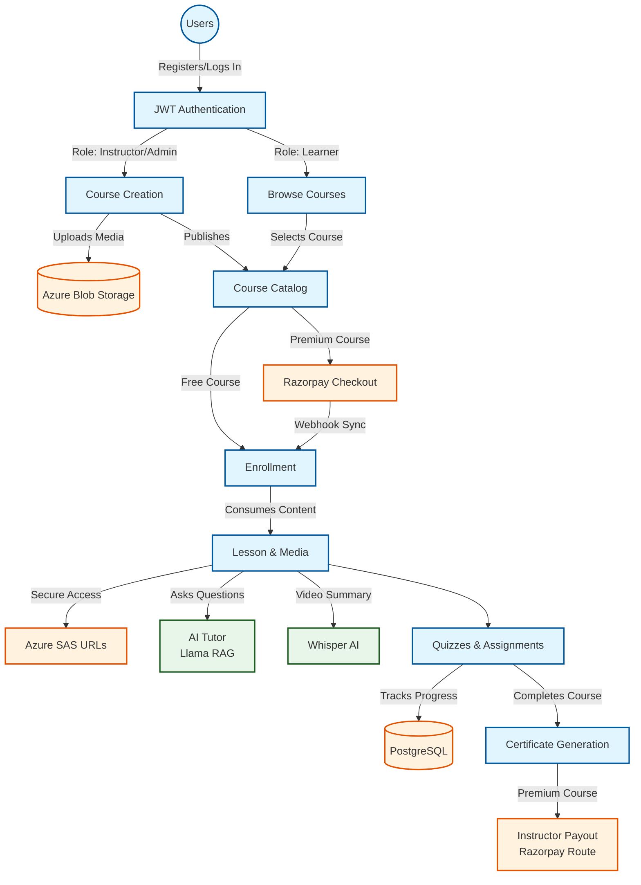

# 🎓 Learning Management System (LMS)

[](PLACEHOLDER_FOR_DEMO_VIDEO_DRIVE_URL)


This repository contains the source code for a comprehensive, enterprise-grade Learning Management System. The project is built with a modern tech stack featuring an Angular frontend, a robust .NET 10 backend API, and a Python microservice, integrating advanced AI capabilities for an enhanced learning experience.

---

## 📋 Table of Contents
1. [Overview](#-overview)
2. [Key Features](#-key-features)
3. [AI Capabilities](#-ai-capabilities)
4. [Technical Highlights](#️-technical-highlights)
5. [Deployment & Infrastructure](#️-deployment--infrastructure)
6. [Application Flow](#-application-flow)
7. [Prerequisites](#-prerequisites)
8. [Setup & Installation](#-setup--installation)
9. [Project Structure](#-project-structure)
10. [Environment Variables](#️-environment-variables)
11. [External Libraries](#-external-libraries)

---

## 🌟 Overview
- Supports **Learners, Instructors, and Administrators**
- Create and manage **Courses, Lessons, Quizzes, and Assignments**
- Supports **Free** and **Premium Courses**
- **Progress Tracking** and Course Completion Monitoring
- Automated **Certificate Generation**
- **Razorpay Integration** for secure course purchases

## ✨ Key Features
- **Course Versioning** – Track and manage course updates
- **AI Tutor** – Ask questions and get lesson-based answers
- **Azure Storage Integration** – Secure storage for videos, PDFs, and resources
- Secure Content Delivery using **Azure SAS URLs**
- **Razorpay Webhook Integration** – Reliable payment status synchronization
- **Automatic Instructor Payouts** – Revenue sharing through Razorpay Route
- **Real-Time Notifications** – Instant updates using SignalR

## 🤖 AI Capabilities
- **AI Tutor (Llama 3.3 70B RAG)**: A context-aware chatbot that helps learners by answering questions based specifically on the lesson content they are currently studying, leveraging Retrieval-Augmented Generation.
- **Smart Transcriptions (Whisper AI)**: Automatically transcribes video lessons and generates smart summaries, making content more accessible and easier to review.

## 🛠️ Technical Highlights
- **ASP.NET Core Web API** & Angular
- **PostgreSQL** & Azure Blob Storage
- **JWT Authentication** & Role-Based Access Control (RBAC)
- **SignalR** Real-Time Notifications
- **Whisper AI** Transcription & Smart Summaries
- **Llama 3.3 70B RAG** Context-Aware Lesson Q&A
- **Hangfire** Background Jobs
- **Serilog** Logging & Monitoring
- **ImageSharp** Image Processing
- **Responsive** User Interface
- **Multi-Tier Architecture**
- **Automated Email Notifications**
- **Assignment & Quiz Deadline Reminders**

## ☁️ Deployment & Infrastructure
- **Containerized & Scalable Architecture** using Docker & Azure Kubernetes Service (AKS)
- **Managed Cloud Services** with PostgreSQL, Redis Cache & Azure Blob Storage
- **Automated CI/CD & Infrastructure Provisioning** using GitHub Actions & Bicep
- **Secure & Reliable Operations** with Azure Key Vault and Cloud-Native Design

---

## 🔄 Application Flow



1. **User Management**: Users register and access the platform as Learners, Instructors, or Administrators with Role-Based Access Control.
2. **Course Creation (Instructors/Admins)**: Instructors build courses, upload media to Azure Blob Storage, and publish them (Free or Premium).
3. **Course Enrollment & Payment**: Learners browse courses. For premium courses, secure payments are processed via Razorpay. Webhooks synchronize payment status instantly.
4. **Learning & AI Assistance**: Learners consume course content via secure Azure SAS URLs. They can interact with the **AI Tutor** (powered by Llama 3.3 70B RAG) for context-aware Q&A based on lesson content.
5. **Assessments & Progress**: Learners complete quizzes and assignments. The system tracks progress in real-time and sends deadline reminders.
6. **Completion**: Upon finishing a course, automated certificates are generated using PdfSharpCore.
7. **Automated Payouts**: Revenue sharing for Instructors is handled automatically via Razorpay Route.

---

## 🛠 Prerequisites

Before setting up the project, ensure you have the following installed on your machine:

### Backend Prerequisites (.NET & AI Engine)
- [.NET 10 SDK](https://dotnet.microsoft.com/download)
- [PostgreSQL](https://www.postgresql.org/download/) (v14 or higher recommended)
- [Redis](https://redis.io/download) (Required for distributed caching)
- [Python 3.10+](https://www.python.org/downloads/) (For the AI Engine)
- Entity Framework Core CLI (optional but recommended for migrations): 
  `dotnet tool install --global dotnet-ef`

### Frontend Prerequisites
- [Node.js](https://nodejs.org/) (v18.x or higher)
- npm (v11+)
- [Angular CLI](https://angular.io/cli) (v21.2+)
  `npm install -g @angular/cli@21`

---

## 🚀 Setup & Installation

### 1. Backend Setup (LMSApi)

The backend is a .NET 10 Web API project using PostgreSQL and Entity Framework Core.

1. **Navigate to the API folder:**
   ```bash
   cd LMSApi/LMSApi.API
   ```

2. **Configure Database Connection:**
   Open `appsettings.Development.json` (or `appsettings.json`) and update the connection strings for PostgreSQL and Redis according to your local setup (refer to the Environment Variables section below).

3. **Start Redis via Docker (Optional):**
   If you don't have Redis installed locally, you can easily spin it up using Docker:
   ```bash
   docker run --name lms-redis -p 6379:6379 -d redis
   ```

4. **Apply Database Migrations:**
   This will create the necessary tables and PostgreSQL functions used by the application.
   ```bash
   dotnet ef migrations add migrationname --project ../LMSApi.DALLibrary --startup-project . --context LMSApi.DALLibrary.Contexts.LMSDbContext
   dotnet ef database update --project ../LMSApi.DALLibrary --startup-project . --context LMSApi.DALLibrary.Contexts.LMSDbContext
   ```
   *(Note: If you have manual SQL scripts like `docs/routines.sql`, execute them against your PostgreSQL database.)*

5. **Run the API:**
   ```bash
   dotnet run
   ```
   The backend API will start running (typically on `https://localhost:5029` or similar).

### 2. Frontend Setup (lms-app)

The frontend is an Angular 21 Single Page Application (SPA).

1. **Navigate to the frontend folder:**
   ```bash
   cd lms-app
   ```

2. **Install Dependencies:**
   ```bash
   npm install
   ```

3. **Configure API Endpoint (Optional):**
   By default, the Angular app expects the API to run on the configured environment URL. Update `src/environments/environment.ts` if your backend is running on a different port.

4. **Run the Development Server:**
   ```bash
   npm start
   ```
   or
   ```bash
   ng serve
   ```
   The application will be accessible at `http://localhost:4200/`.

### 3. AI Engine Setup (ai-engine)

1. **Navigate to the ai-engine folder:**
   ```bash
   cd ai-engine
   ```

2. **Install Python dependencies:**
   ```bash
   pip install -r requirements.txt
   ```

3. **Run the FastAPI server:**
   ```bash
   uvicorn main:app --reload
   ```

---

## 📚 Project Structure

- **`LMSApi/`**: Backend API solution (.NET 10, C#).
  - `LMSApi.API/`: Main API entry point, controllers, and configuration.
  - `LMSApi.BALLibrary/`: Business logic layer, services (e.g., Razorpay payment providers).
  - `LMSApi.DALLibrary/`: Data access layer, Entity Framework contexts, migrations.
- **`lms-app/`**: Frontend web application (Angular 21, TypeScript, TailwindCSS).
  - `src/app/`: Angular components, services, pages, and routing.
- **`ai-engine/`**: Python-based microservice for AI features.
  - `routers/`: API endpoints for AI tutor and transcription services.
- **`azure/`**: Infrastructure as Code (Bicep) and Kubernetes (AKS) deployment manifests.
- **`.github/workflows/`**: CI/CD pipelines for automated build and infrastructure deployment.
- **`docs/`**: Documentation and raw SQL scripts (`routines.sql`).

---

## ⚙️ Environment Variables

### Backend (`LMSApi/LMSApi.API/appsettings.Development.json`)
```json
{
  "ConnectionStrings": {
    "DefaultConnection": "Host=localhost;Database=LmsDb;Username=postgres;Password=your_password",
    "Redis": "localhost:6379"
  },
  "Jwt": {
    "Key": "Your_Super_Secret_Key_Here",
    "Issuer": "LMSApi",
    "Audience": "LMSApp"
  },
  "Razorpay": {
    "KeyId": "your_razorpay_key",
    "KeySecret": "your_razorpay_secret"
  },
  "AzureBlob": {
    "ConnectionString": "your_azure_blob_connection_string",
    "ContainerName": "lms-media"
  },
  "AiEngine": {
    "BaseUrl": "http://localhost:8000"
  }
}
```

### Frontend (`lms-app/src/environments/environment.ts`)
```typescript
export const environment = {
  production: false,
  apiUrl: 'https://localhost:5029/api',
  razorpayKey: 'your_razorpay_key'
};
```

---

## 📦 External Libraries

### Backend (.NET)
- **AutoMapper**: Simplifies object-to-object mapping.
- **CloudinaryDotNet**: Integration with Cloudinary for managing user uploads.
- **Hangfire**: Background job processing with PostgreSQL storage support.
- **StackExchange.Redis**: Distributed caching.
- **PdfSharpCore**: Programmatic PDF generation (e.g., certificates).
- **Razorpay**: Payment gateway integration.
- **SixLabors.ImageSharp**: Image manipulation and processing.
- **ClosedXML**: Excel spreadsheet manipulation.
- **System.IdentityModel.Tokens.Jwt**: JWT generation and validation.
- **Entity Framework Core / Npgsql**: ORM and PostgreSQL support.
- **Serilog**: Structured logging.
- **Swashbuckle.AspNetCore**: Swagger UI API documentation.

### Frontend (Angular)
- **@microsoft/signalr**: Real-time web functionality (notifications, updates).
- **marked**: Markdown parser for rich text content rendering.
- **pdfjs-dist**: Web standards-based platform for rendering PDFs in browser.
- **rxjs**: Reactive Extensions Library for JavaScript.
- **tailwindcss / @tailwindcss/postcss**: Utility-first CSS framework.
- **vitest / jsdom**: Fast unit testing framework.
- **prettier**: Code formatting.
